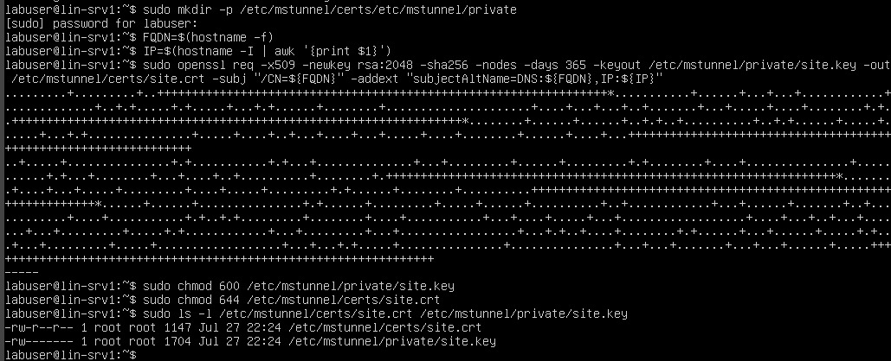
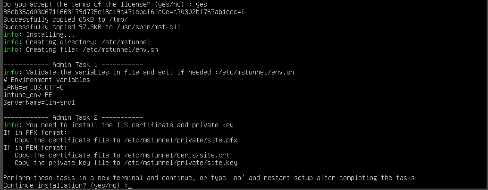
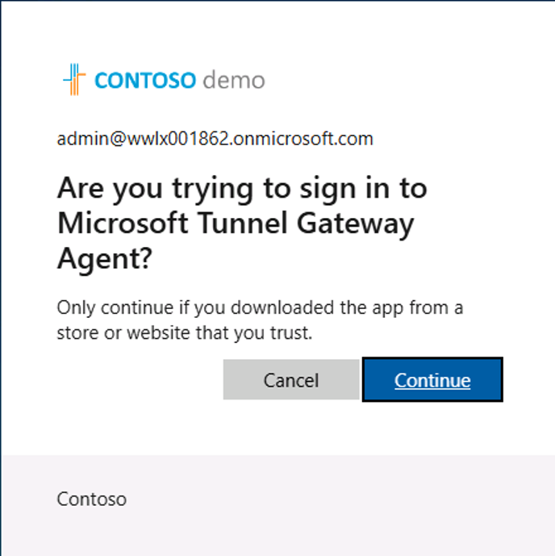
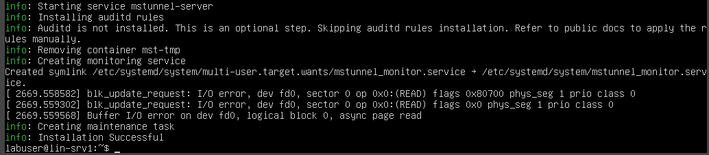
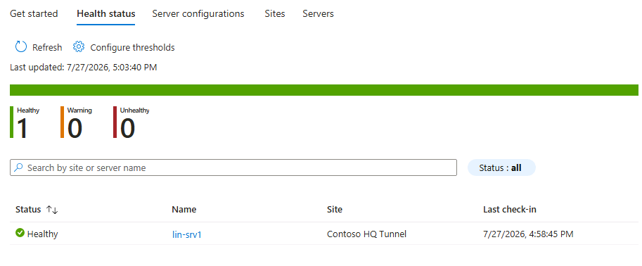

---
lab:
   title: 'Lab 04: デバイスの保護'
   description: 'このラボでは、Microsoft Defender for Endpoint を統合し、エンドポイント セキュリティ ポリシーを展開し、BitLocker 暗号化を構成し、Microsoft Tunnel Gateway を展開し、Microsoft Cloud PKI を実装します。'
   duration: 110 minutes
   level: 200
   islab: true
   primarytopics:
      - Microsoft Intune
      - Microsoft Defender for Endpoint
      - Microsoft Tunnel
      - Microsoft Cloud PKI
      - Windows
---

# ラボ 04: デバイスの保護

## ラボのシナリオ

あなたは Contoso Healthcare のモダン エンドポイント管理者である **Jordan Chen** です。デバイスの登録とアプリケーションの展開が完了したので、次は包括的なセキュリティ制御を実装する必要があります。EDR 機能のために Microsoft Defender for Endpoint を統合し、エンドポイント セキュリティ ポリシー（ウイルス対策、ファイアウォール、攻撃面の縮小）を展開し、Microsoft Entra キー エスクローを使用した BitLocker 暗号化を構成し、セキュアな VPN アクセスのために Microsoft Tunnel Gateway を展開し、証明書ベースの認証のために Microsoft Cloud PKI を実装します。

このラボの終了時には、次のことが完了しています。
- Intune と Microsoft Defender for Endpoint の統合を有効化する
- EDR ポリシーを使用して Windows デバイスを Defender for Endpoint にオンボードする
- Microsoft Defender セキュリティ ベースラインを展開する（`Pharmacy` スコープ タグを付与）
- ウイルス対策、ファイアウォール、攻撃面の縮小のポリシーを構成する（ASR はパイロット グループに **ブロック** モード、より広範な端末群に **監査** モードで分割割り当て）
- Microsoft Entra 回復キー エスクローを使用した BitLocker 暗号化ポリシーを作成する（`Pharmacy` を付与）
- Ubuntu サーバー上に Microsoft Tunnel Gateway を展開する
- Microsoft Tunnel 接続用の VPN プロファイルを作成する
- ルート CA と発行 CA を使用して Microsoft Cloud PKI を実装する
- デバイス認証用の SCEP 証明書プロファイルを作成して展開する
- 影響を検証した後、条件付きアクセス ポリシーを **レポート専用** から **オン** に切り替える

---

## ラボの所要時間

**推定所要時間:** 110 分

---

## 手順

### 開始する前に

このラボには次のものが必要です。
- **Lab 01** の完了（デバイスが登録済みであること）
- Contoso の Microsoft 365 テナント（`<TenantPrefix>.onmicrosoft.com`）へのアクセス
- **Microsoft 365 E5** ライセンス（Defender for Endpoint P2 を含む）
- **Microsoft Intune Suite トライアルが有効であること**（**Lab 01** の前提条件で有効化済み）— Cloud PKI（演習 5）に必要です。Microsoft Tunnel（演習 4）は Intune Plan 1 に含まれており Suite は不要ですが、**LIN-SRV1** Ubuntu サーバーが必要です
- グローバル管理者または Intune 管理者の資格情報
- **SEA-DEV1** と **SEA-DEV2**（登録済みの Windows 11 デバイス）
- **LIN-SRV1**（Microsoft Tunnel Gateway 用の Ubuntu 22.04 サーバー）

> [!IMPORTANT]
> **このラボは早めに開始してください。** Microsoft Defender for Endpoint テナントの初回オンボード（演習 1）は、完全にプロビジョニングされるまでに **数時間** かかることがあります。コネクタをオンにした直後は、デバイス インベントリ、オンボード状態、セキュリティ シグナルが Defender ポータルにすぐには表示されません。演習 1 まで状態確認を待って、すぐに完了すると期待しないでください。ラボを開始したらできるだけ早くコネクタを有効化してデバイスをオンボードし、バックグラウンドで Defender のプロビジョニングが進む間に残りの演習を続けてください。後でオンボード状態を確認しに戻ったときにデバイスがまだ **Pending** と表示されていても、それは想定どおりです。トラブルシューティングの前にもう少し時間をおいてください。

---

## 演習 1: Microsoft Defender for Endpoint を統合する

### シナリオ

Microsoft Defender for Endpoint は、EDR（エンドポイントの検出と対応）、高度な脅威保護、自動調査の機能を提供します。Intune と Defender の間のコネクタを有効化し、EDR 構成ポリシーを使用して Windows デバイスをオンボードします。

### タスク 1: Microsoft Defender for Endpoint コネクタを有効化する

Intune と Defender for Endpoint のコネクタは **2 つのポータル** にまたがるセットアップです。まず **Microsoft Defender ポータル** で **Microsoft Intune 接続** トグルを *最初に* オンにし、その後で **Intune** 管理センターの **Connect Windows devices...** トグルが有効になります。Defender ポータルでの手順をスキップすると、Intune のページには **接続状態: 使用不可** と表示され、すべてのトグルがグレー表示になります。

#### パート A — Microsoft Defender ポータルから接続を確立する

1. SEA-DEV1の **Microsoft Edge** で新しいタブを開き、**https://security.microsoft.com** にアクセスします。

2. **admin@<TenantPrefix>.onmicrosoft.com** でサインインします。

3. **Microsoft Defender** ポータルの左ナビゲーションで **資産** を展開し、**デバイス** を選択します。

4. **デバイス インベントリ** ページで、**オンボード** を選択します。

5. **全般** の下で、**オプション機能** を選択します。

6. **Microsoft Intune 接続** トグルを見つけ、**オン** に設定します。

7. ページ下部の **ユーザー設定の保存** を選択します。

   > [!NOTE]
   > ここで保存することで、双方向コネクタが確立されます。この手順を行わないと、Intune 管理センターの Defender for Endpoint ページは読み取り専用になります。

#### パート B — Intune 管理センターからコネクタを構成する

1.  **Microsoft Edge** で **Microsoft Intune 管理センター** のタブに戻ります（または **https://intune.microsoft.com** を開きます）。

2. **Microsoft Intune 管理センター** で **エンドポイント セキュリティ** を選択し、**セットアップ** セクションの下で **Microsoft Defender for Endpoint** を選択します。

3. ページ上部で **更新** を選択します。**接続状態** が 1 分以内に **使用不可** から **使用可能** に変わります（初回は 1 ～ 2 分かかることがあります）。

4. **エンドポイント セキュリティ | Microsoft Defender for Endpoint** ページで、次を構成します。

   - **エンドポイント セキュリティ プロファイルの設定:**
      - **Microsoft Defender for Endpoint によるエンドポイント セキュリティ構成の適用を許可する:** オン
   - **コンプライアンス ポリシーの評価:**
      - **バージョン 10.0.15063 以降の Windows デバイスを Microsoft Defender for Endpoint に接続する:** オン

   > [!NOTE]
   > コネクタを有効化すると、Intune はデバイス データを Defender for Endpoint に送信し、脅威インテリジェンスを受信できるようになります。2 つ目の設定により、Defender は、Intune によってまだ完全には管理されていないデバイスに対してもセキュリティ構成を適用できます。

5. ページ上部の **保存** を選択します。

**Microsoft Defender for Endpoint コネクタが正常に有効化されました。**

---

### タスク 2: エンドポイントの検出と対応 (EDR) ポリシーを作成する

エンドポイントの検出と対応 (EDR) ポリシーは、必要なセンサーと構成を展開することで、デバイスを Defender for Endpoint にオンボードします。

1. **Microsoft Intune 管理センター** で、**エンドポイント セキュリティ** → **エンドポイントの検出と対応** に移動します。

2. **+ ポリシーの作成** を選択します。

3. **プロファイルの作成** ペインで、次を構成します。
   - **プラットフォーム:** Windows
   - **プロファイル:** エンドポイントの検出と対応

4. **作成** を選択します。

5. **基本情報** タブで、次を入力します。
   - **名前:** `EDR - Defender Onboarding`
   - **説明:** `Onboards Windows devices to Microsoft Defender for Endpoint`

6. **次へ** を選択します。

7. **構成設定** ページで、次を構成します。
   - **Microsoft Defender for Endpoint クライアント構成パッケージの種類:** **コネクタから自動**
   - **サンプルの共有:** **すべて（既定値）**
   - **[非推奨] テレメトリ レポートの頻度:** **迅速化**

8. **次へ** を選択します。

9. **スコープ タグ** タブで、**次へ** を選択します。

10. **割り当て** タブで、**グループ名で検索...** を選択して、利用可能なグループの一覧を表示します。

11. **dyn-Windows-Devices** を検索して選択します。

12. **次へ** を選択します。

13. **レビューと作成** タブで、**作成** を選択します。

**デバイスを Defender for Endpoint にオンボードする EDR ポリシーが正常に作成されました。**

---

### タスク 3: Microsoft Defender ポータルでデバイスのオンボードを確認する

1.  **Microsoft Edge** で新しいタブを開き、**https://security.microsoft.com** にアクセスします。

2. まだサインインしていない場合は、**admin@<TenantPrefix>.onmicrosoft.com** でサインインします。

3. **Microsoft Defender ポータル** の左ナビゲーションで **資産** を展開し、**デバイス** を選択します。

4. SEA-DEV1 と SEA-DEV2 が Defender for Endpoint にオンボードされるまで 10 ～ 15 分待ちます。

   > [!NOTE]
   > デバイスのオンボードは、EDR ポリシーが適用されてから 10 ～ 30 分かかることがあります。Intune でデバイスの同期を強制すると、処理を加速できます。

5. デバイスが表示されたら、デバイス一覧から **SEA-DEV1** を選択します。

6. デバイスの詳細を確認します。
   - **リスク レベル:** 低、中、高、またはセキュア
   - **露出レベル:** セキュリティ構成スコアに基づく
   - **センサーの正常性状態:** アクティブ、非アクティブ、または構成の誤り
   - **オンボード状態:** オンボード済み

**Microsoft Defender for Endpoint へのデバイスのオンボードが正常に確認されました。**

---

## 演習 2: エンドポイント セキュリティ ポリシーを展開する

### シナリオ

エンドポイント セキュリティ ポリシーは、完全な構成プロファイルの複雑さを伴わずに、対象を絞ったセキュリティ制御を提供します。Microsoft Defender セキュリティ ベースライン、ウイルス対策ポリシー、ファイアウォール ポリシー、攻撃面の縮小ルールを展開します。

### タスク 1: Microsoft Defender セキュリティ ベースラインを展開する

セキュリティ ベースラインは、Microsoft のセキュリティ ガイダンスに基づく推奨設定を事前構成したコレクションです。

1. **Microsoft Intune 管理センター** で、**エンドポイント セキュリティ** → **セキュリティ ベースライン** に移動します。

2. 一覧から **Microsoft Defender for Endpoint Security Baseline** を選択します。

3. **+ ポリシーの作成** を選択します。

4. **プロファイルの作成** ペインで、**作成** を選択します。

5. **基本情報** ページで、次を入力します。
   - **名前:** `Security Baseline - Defender for Endpoint`
   - **説明:** `Microsoft-recommended security settings for Defender for Endpoint`

6. **次へ** を選択します。

7. **構成設定** タブで、既定の設定を確認します。

   > [!NOTE]
   > このベースラインには、次の項目の設定が含まれています。
   > - BitLocker 暗号化
   > - Credential Guard
   > - Application Guard
   > - 攻撃面の縮小ルール
   > - Exploit protection
   > - ネットワーク保護

8. カテゴリをスクロールし、事前構成された値を確認します。個々の設定はカスタマイズできますが、このラボでは既定値を受け入れます。

9. **次へ** を選択します。

10. **スコープ タグ** タブで、**+ スコープ タグの選択** を選択し、**Pharmacy**（**Lab 01 演習 2 タスク 6** で作成）を選択して、**選択** を選択します。**Default** スコープ タグが存在する場合は削除します。

11. **次へ** を選択します。

12. **割り当て** タブの **包含されたグループ** の下で、**グループの追加** を選択します。

13. **dyn-Windows-Devices** を検索して選択します。

14. **選択** を選択します。

15. **次へ** を選択します。

16. **レビューと作成** タブで、**作成** を選択します。

**Microsoft Defender セキュリティ ベースラインが正常に展開されました。**

---

### タスク 2: ウイルス対策ポリシーを作成する

ウイルス対策ポリシーは、リアルタイム保護、クラウド保護、スキャン動作など、Microsoft Defender ウイルス対策の設定を構成します。

1. **Microsoft Intune 管理センター** で、**エンドポイント セキュリティ** → **ウイルス対策** に移動します。

2. **+ ポリシーの作成** を選択します。

3. **プロファイルの作成** ペインで、次を構成します。
   - **プラットフォーム:** Windows
   - **プロファイル:** Microsoft Defender Antivirus

4. **作成** を選択します。

5. **基本情報** タブで、次を入力します。
   - **名前:** `Antivirus - Defender Configuration`
   - **説明:** `Configures real-time protection, cloud protection, and scan settings`

6. **次へ** を選択します。

7. **構成設定** ページで、**Defender** を展開し、次を構成します。
   - **アーカイブ スキャンを許可:** 許可
   - **動作の監視を許可:** 許可
   - **クラウド保護を許可:** 許可
   - **フル スキャン時のリムーバブル ドライブのスキャンを許可:** 許可
   - **リアルタイム監視を許可:** 許可
   - **ネットワーク ファイルのスキャンを許可:** 許可
   - **クラウド ブロック レベル:** 高
   - **クラウドの拡張タイムアウト:** 50 秒
   - **スキャン パラメーター:** クイック スキャン
   - **スケジュール スキャンの曜日:** 毎日
   - **スケジュール スキャンの時刻:** 120（深夜からの経過分数。午前 2:00 に相当）
   - **サンプル送信の同意:** すべてのサンプルを自動的に送信
   - **オンアクセス保護を許可:** 許可

   > [!NOTE]
   > これらはすべて、このページの単一の **Defender** カテゴリの下にあります。展開する別の「Scans」セクションはありません。このカテゴリには、他にも多数の設定（アーカイブ / CPU / ネットワーク解析のオプション、脅威の重大度に応じた修復アクションなど）がありますが、上記に記載されていないものはすべて既定の **構成されていません** のままにしてください。このラボでは、上記のフィールドだけを設定すれば十分です。

8. **次へ** を選択します。

9. **スコープ タグ** タブで、**スコープ タグの検索...** を選択し、**Pharmacy** を追加して、**次へ** を選択します。

10. **割り当て** タブで、**dyn-Windows-Devices** を検索して選択します。

11. **次へ** → **作成** の順に選択します。

> [!IMPORTANT]
> **エンドポイント セキュリティ ポリシーの優先順位。** ここまでで、Defender セキュリティ ベースライン（タスク 1）と、独立したウイルス対策ポリシー（タスク 2）の両方を展開しました。どちらも、同じ Defender ウイルス対策の設定（リアルタイム監視、クラウド保護）の一部を扱います。Intune は、重複するエンドポイント セキュリティ設定を、ポリシーの **優先度** を使用して解決します。設定ごとに、より新しく作成された、または優先度の高いポリシーが優先され、解決できない競合は **エンドポイント セキュリティ** → **すべてのデバイス** に **競合** 状態として表示されます。運用環境では、設定カテゴリごとに信頼できる情報源を 1 つ選んでください。ベースラインに所有させるか、ベースラインから設定を取り除いて独立したポリシーを使用します。

**ウイルス対策ポリシーが正常に作成されました。**

---

### タスク 3: ファイアウォール ポリシーを作成する

ファイアウォール ポリシーは、Windows Defender ファイアウォールの規則と動作を構成します。

1. **Microsoft Intune 管理センター** で、**エンドポイント セキュリティ** → **ファイアウォール** に移動します。

2. **+ ポリシーの作成** を選択します。

3. **プロファイルの作成** ペインで、次を構成します。
   - **プラットフォーム:** Windows
   - **プロファイル:** Windows Firewall

4. **作成** を選択します。

5. **基本情報** タブで、次を入力します。
   - **名前:** `Firewall - Defender Configuration`
   - **説明:** `Enables the firewall for all network profiles`

6. **次へ** を選択します。

7. **構成設定** ページで、**検索** ボックスを使用して、以下の各設定を見つけて構成します。

8. **ドメイン ネットワーク ファイアウォール** を構成します。
   - **ドメイン ネットワーク ファイアウォールを有効化:** True（既定値）
   - **ステルス モードを無効化:** False（既定値）
   - **成功した接続のログを有効化:** 成功した接続のログ記録を有効にする
   - **ドロップされたパケットのログを有効化:** ドロップされたパケットのログ記録を有効にする

9. **プライベート ネットワーク ファイアウォール** を、ドメイン プロファイルと同じ設定で構成します。
   - **プライベート ネットワーク ファイアウォールを有効化:** True（既定値）
   - **ステルス モードを無効化:** False（既定値）
   - **成功した接続のログを有効化:** 成功した接続のログ記録を有効にする
   - **ドロップされたパケットのログを有効化:** ドロップされたパケットのログ記録を有効にする

10. **パブリック ネットワーク ファイアウォール** を構成します。
    - **パブリック ネットワーク ファイアウォールを有効化:** True（既定値）
    - **ステルス モードを無効化:** False（既定値）
    - **パブリック プロファイルの既定の受信アクション:** ブロック（既定値）
    - **成功した接続のログを有効化:** 成功した接続のログ記録を有効にする
    - **ドロップされたパケットのログを有効化:** ドロップされたパケットのログ記録を有効にする

    > [!NOTE]
    > **成功した接続のログを有効化** と **ドロップされたパケットのログを有効化** は、検索するとそれぞれ **3 行**（プロファイルごとに 1 行）返されます。フィールド名は各行で同一ですが、上記で各プロファイルに分けて記載しているのはそのためです。

11. **次へ** を選択します。

12. **スコープ タグ** ページで、**Pharmacy** を追加して、**次へ** を選択します。

13. **割り当て** ページで、**dyn-Windows-Devices** に割り当てます。

14. **次へ** → **作成** の順に選択します。

**ファイアウォール ポリシーが正常に作成されました。**

---

### タスク 4: パイロット/監査を分割割り当てした攻撃面の縮小 (ASR) ポリシーを作成する

攻撃面の縮小ルールは、Office ドキュメントからの実行可能ファイルの起動や、難読化されたスクリプトの実行など、マルウェアが一般的に使用する動作をブロックします。上級者向けの ASR 展開パターンは、パイロット グループではルールを **ブロック** モードで有効化し、それ以外の全員に対しては **監査** モードのままにするというものです。小規模なグループで実際に強制することで誤検知を早期に洗い出し、その一方で残りの端末群は、広範な展開の影響を予測するために使用できる監査ログを生成します。ここでは、同じルールで異なるモードを持つ 2 つのポリシーを作成し、それぞれ異なるグループに割り当てることで、これを実現します。

#### ポリシー 1 — パイロット グループ向けの ASR ブロック モード

1. **Microsoft Intune 管理センター** で、**エンドポイント セキュリティ** → **攻撃面の縮小** に移動します。

2. **+ ポリシーの作成** を選択します。

3. **プロファイルの作成** ペインで、次を構成します。
   - **プラットフォーム:** Windows
   - **プロファイル:** 攻撃面の縮小ルール

4. **作成** を選択します。

5. **基本情報** タブで、次を入力します。
   - **名前:** `ASR - Block (Pilot)`
   - **説明:** `ASR rules in Block mode for pilot cohort — real enforcement on a small group`

6. **次へ** を選択します。

7. **構成設定** タブで、次の ASR ルールを **すべてブロック モード** で構成します。

   - **メール クライアントと Web メールからの実行可能なコンテンツをブロック:** ブロック
   - **すべての Office アプリケーションによる子プロセスの作成をブロック:** ブロック
   - **Office アプリケーションによる実行可能なコンテンツの作成をブロック:** ブロック
   - **Office アプリケーションによる他のプロセスへのコードの挿入をブロック:** ブロック
   - **JavaScript または VBScript によるダウンロードされた実行可能なコンテンツの起動をブロック:** ブロック
   - **難読化された可能性のあるスクリプトの実行をブロック:** ブロック
   - **Office マクロからの Win32 API 呼び出しをブロック:** ブロック
   - **Windows のローカル セキュリティ機関サブシステムからの資格情報の盗難をブロック:** ブロック
   - **PSExec および WMI コマンドから発生するプロセスの作成をブロック:** ブロック
   - **USB から実行される、信頼されていない未署名のプロセスをブロック:** ブロック
   - **WMI イベント サブスクリプションによる永続化をブロック:** ブロック

8. **次へ** を選択します。

9. **スコープ タグ** タブで、**スコープ タグの検索...** を選択し、**Pharmacy** を追加して、**次へ** を選択します。

10. **割り当て** タブで、**sg-Intune-Pilot-Users**（**Lab 01 演習 1** のパイロット グループ）に割り当てます。

11. **次へ** → **作成** の順に選択します。

#### ポリシー 2 — より広範な端末群向けの ASR 監査モード

1. **エンドポイント セキュリティ | 攻撃面の縮小** ページで、もう一度 **+ ポリシーの作成** を選択します。

2. **プロファイルの作成** ペインで、次を構成します。
   - **プラットフォーム:** Windows
   - **プロファイル:** 攻撃面の縮小ルール

3. **作成** を選択します。

4. **基本情報** タブで、次を入力します。
   - **名前:** `ASR - Audit (Fleet)`
   - **説明:** `Same ASR rules in Audit mode for the broader fleet — generates Audit logs without enforcement`

5. **次へ** を選択します。

6. **構成設定** タブで、**上記と同じ ASR ルール** を構成しますが、それぞれ **ブロック** モードではなく **監査** モードに設定します。（例外が 1 つあります。`Block credential stealing from lsass.exe` は **ブロック** モードのままにしてください。これは誤検知率が最も低い ASR ルールであり、初日から端末群全体で強制する価値があります。）

7. **次へ** を選択します。

8. **スコープ タグ** タブで、**Default** スコープ タグのままにします（これは端末群全体が対象です）。**次へ** を選択します。

9. **割り当て** タブで、**dyn-Windows-Devices** を検索して選択します。**sg-Intune-Pilot-Users** を追加し（パイロット メンバーが両方ではなくブロック ポリシーだけを受け取るようにするため）、その **ターゲットの種類** を **除外** に設定します。

10. **次へ** → **作成** の順に選択します。

> [!NOTE]
> 分割モード パターン（パイロットにブロック、それ以外全員に監査）は、標準的な ASR 展開です。**レポート** → **エンドポイント セキュリティ** → **攻撃面の縮小ルール** を 1 ～ 2 週間観察してください。監査ログで、ルールが正当な脅威に対してのみ発動したはずである（より広範な端末群で誤検知がない）ことが示されたら、監査ポリシーをブロックに切り替えます。

**パイロットにブロック、端末群に監査を割り当てた分割割り当ての ASR ポリシーが正常に作成されました。**

---

## 演習 3: BitLocker 暗号化を構成する

### シナリオ

BitLocker は OS ドライブ全体を暗号化し、保存データを保護します。TPM+PIN 保護を要求し、回復キーを Microsoft Entra ID にエスクローする BitLocker ポリシーを構成します。

### タスク 1: BitLocker ポリシーを作成する

1. **Microsoft Intune 管理センター** で、**エンドポイント セキュリティ** → **ディスク暗号化** に移動します。

2. **+ ポリシーの作成** を選択します。

3. **プロファイルの作成** ペインで、次を構成します。
   - **プラットフォーム:** Windows
   - **プロファイル:** BitLocker

4. **作成** を選択します。

5. **基本情報** タブで、次を入力します。
   - **名前:** `BitLocker - Full Disk Encryption`
   - **説明:** `Requires BitLocker encryption with TPM and PIN, recovery keys escrowed to Entra ID`

6. **次へ** を選択します。

7. **構成設定** タブで、**BitLocker** を展開し、次を構成します。
   - **デバイスの暗号化を必須にする:** 有効
   - **他のディスク暗号化に関する警告を許可:** 有効

8. **固定データ ドライブ** を展開し、次を構成します。
   - **固定データ ドライブでドライブ暗号化の種類を適用する:** 有効にする
   - **BitLocker で保護された固定ドライブの回復方法を選択:** 有効
   - **オペレーティング システム ドライブの BitLocker 回復情報を AD DS に保存する:** True
   - **オペレーティング システム ドライブの回復情報が AD DS に保存されるまで BitLocker を有効にしない:** True

9. **オペレーティング システム ドライブ** を展開し、次を構成します。
   - **固定データ ドライブでドライブ暗号化の種類を適用する:** 有効にする
   - **スタートアップ時に追加の認証を要求する:** 有効
   - **TPM スタートアップ キーを構成:** TPM でスタートアップ キーを必須にする
   - **互換性のある TPM スタートアップ キーと PIN:** TPM でスタートアップ キーと PIN を必須にする
   - **TPM スタートアップを構成:** TPM を許可しない
   - **TPM スタートアップ PIN を構成:** TPM でスタートアップ PIN を許可しない
   - **スタートアップ用の最小 PIN 長を構成:** 有効
   - **最小文字数:** 6
   - **BitLocker で保護されたオペレーティング システム ドライブの回復方法を選択:** 有効
   - **オペレーティング システム ドライブの BitLocker 回復情報を AD DS に保存する:** True
   - **BitLocker 回復情報のユーザー ストレージを構成:** 48 桁の回復パスワードを必須にする

   > [!NOTE]
   > TPM+PIN を要求すると、2 要素の保護が提供されます。所有しているもの（TPM チップ）＋知っているもの（PIN）です。Entra ID にエスクローされた回復キーにより、ユーザーが PIN を忘れた場合に IT 管理者がキーを取得できます。

10. **次へ** を選択します。

11. **スコープ タグ** タブで、**Pharmacy** を検索して選択し、**次へ** を選択します。Pharmacy の臨床ワークステーションでの BitLocker は HIPAA 統制であり、ポリシーを `Pharmacy` スコープ タグの下に置くことで、Pharmacy ヘルプデスク（**Lab 05 演習 3** で割り当て）がそれを参照して監査できます。

12. **割り当て** タブで、**dyn-Windows-Devices** を検索して選択します。

13. **次へ** → **作成** の順に選択します。

**BitLocker 暗号化ポリシーが正常に作成されました。**

---

### タスク 2: BitLocker 暗号化の状態を監視する

1. **SEA-DEV1** で、BitLocker ポリシーが適用されるまで 10 ～ 15 分待ちます。

   > [!NOTE]
   > BitLocker 暗号化は、ドライブのサイズやシステムのパフォーマンスに応じて、完了までに 1 ～ 3 時間かかることがあります。ラボの目的上、ポリシーが適用され、暗号化が開始されたことを確認します。

2. **SEA-DEV1** で、**Terminal (Admin)** を開きます（**Start** を右クリック → **Terminal (Admin)**。**Windows Terminal** は既定で **PowerShell** タブを開きます）。

3. **Do you want to allow this app to make changes to your device?** というプロンプトで、**Yes** を選択します。

4. BitLocker の状態を確認します。

   ```powershell
   manage-bde -status C:
   ```

5. 出力を確認します。
   - **Conversion Status:** "Encryption in Progress" または "Fully Encrypted" と表示されているはずです
   - **Encryption Method:** XTS-AES 128 または XTS-AES 256
   - **Protection Status:** Protection On
   - **Lock Status:** Unlocked

6. **Microsoft Intune 管理センター** で、**デバイス** → **すべてのデバイス** → **SEA-DEV1** に移動します。

7. 左ナビゲーションから **回復キー** を選択します。

8. C: ドライブの BitLocker 回復キーが Microsoft Entra ID にエスクローされていることを確認します。

   > [!NOTE]
   > 回復キーは Entra ID に保存され、ユーザーが BitLocker PIN を忘れた場合に、グローバル管理者またはヘルプデスク管理者が取得できます。

   > [!NOTE]
   > 最初は **No BitLocker recovery key found for this device** というメッセージが表示されるのが想定どおりです。キーは、暗号化が開始され（**Protection On**）、*かつ* その後にデバイスが同期するまでエスクローされません。TPM+PIN の場合、これに 10 ～ 30 分の遅延が生じることがあります。

**BitLocker 暗号化の状態が正常に監視され、回復キーのエスクローが確認されました。**

---

### タスク 3: BitLocker 回復キーを取得する

> [!NOTE]
> 回復キーがまだ表示されていない場合は、このタスクをスキップして後で戻ってきてください。キーがここに表示されるのは、BitLocker が暗号化を開始し（**Protection On**）、デバイスがキーを Microsoft Entra ID にエスクローした後だけであり、これには時間がかかることがあります。**演習 4** に進み、キーが **回復キー** ブレードに反映されたら **タスク 3** に戻ってください。

1. **Microsoft Intune 管理センター** で、**デバイス** → **すべてのデバイス** → **SEA-DEV1** に移動します。

2. 左ナビゲーションから **回復キー** を選択します。

3. **C:** ドライブの回復キーを見つけます。

4. **回復キーの表示** を選択します（求められた場合は、MFA で確認するか、再認証します）。

5. 回復キーは次の形式で表示されます。

   ```
   123456-789012-345678-901234-567890-123456-789012-345678
   ```

   > [!NOTE]
   > このキーは、TPM が故障した場合やユーザーが PIN を忘れた場合に、ドライブのロックを解除するために使用できます。運用環境では、承認されたヘルプデスク スタッフだけが回復キーにアクセスできるようにする必要があります。

**Microsoft Entra ID から BitLocker 回復キーが正常に取得されました。**

---

## 演習 4: Microsoft Tunnel Gateway を展開する

### シナリオ

Microsoft Tunnel は、モバイル デバイスにオンプレミスおよびクラウドのリソースへのセキュアなアクセスを提供する VPN ゲートウェイ ソリューションです。Ubuntu サーバー（LIN-SRV1）に Tunnel Gateway を展開し、Intune に登録し、モバイル デバイスが使用する VPN プロファイルを作成します。

> [!IMPORTANT]
> **範囲。** この演習では、ゲートウェイの展開、Intune への登録、VPN プロファイルの作成を扱います。ラボ環境にはモバイル デバイスが含まれていないため、**ゲートウェイを介した実際のクライアント VPN 接続は範囲外です**。これは Lab 01 で実際の Autopilot OOBE が範囲外とされているのと同様です。このラボは、LIN-SRV1 サーバーが **テナント管理** → **Microsoft Tunnel Gateway** → **サーバー**（タスク 4）で **オンライン** として表示され、VPN プロファイルが作成されて割り当てられた（タスク 5）時点で完了です。
>
> Microsoft Tunnel Gateway は **Intune Plan 1** に含まれています（Suite は不要です）。LIN-SRV1 がラボ環境で利用できない場合は、手順を概念的に確認するか、演習 5 にスキップしてください。

### 開始する前に: Linux ターミナルの操作

このコースの他の VM とは異なり、**LIN-SRV1** はグラフィカル デスクトップのない **Ubuntu Linux** で動作します。テキスト **ターミナル** でコマンドを入力し、**Enter** を押すことで、完全にテキスト操作で対話します。

**サインイン。** 求められたら、次でサインインします。

- **ユーザー名:** `labuser`
- **パスワード:** Skillable ラボの **Resources** パネルで LIN-SRV1 用に提供されているパスワード（他の VM の資格情報が見つかるのと同じ場所です）。

**管理者としてのコマンドの実行 (`sudo`)。** 多くのセットアップ手順は `sudo`（「superuser do」）で始まり、そのコマンドだけを管理者権限で実行します。これは Windows の「Run as administrator」に相当する Linux の操作です。セッションで初めて `sudo` を使用するときに、`labuser` のパスワードを再度求められることがあります。パスワードを入力しても、**画面には何も表示されません**（ドットやアスタリスクもありません）。これは正常です。入力して **Enter** を押してください。

**よく使うコマンド**。移動やファイルの確認に使用します。

| コマンド | 機能 |
| --- | --- |
| `pwd` | 現在のディレクトリを表示します（「今どこにいるか」）。 |
| `ls` | 現在のディレクトリ内のファイルとフォルダーを一覧表示します。 |
| `ls -l` | 詳細（アクセス許可、サイズ、日付）付きで一覧表示します。 |
| `cd foldername` | フォルダーに移動します。 |
| `cd ..` | 1 つ上のフォルダー レベルに移動します。 |
| `cd ~` | ホーム ディレクトリに戻ります。 |
| `cat filename` | ファイルの内容を画面に表示します。 |
| `clear` | ターミナル画面をクリアします。 |

> [!TIP]
> ラボ コンソールでコピー/貼り付けやテキスト入力が正しく動作しない場合は、コマンドを手動で入力できます。コマンドは短いものです。Linux のコマンドとファイル パスは **大文字と小文字が区別される** ため、示されているとおりに正確に入力してください。

### タスク 1: LIN-SRV1 サーバーを準備する

1. **LIN-SRV1**（Ubuntu 22.04 サーバー）に切り替えます。

2. Skillable の **Resources** パネルで LIN-SRV1 用に提供されているパスワードを使用して、**`labuser`** としてサインインします。

3. Docker がインストールされていることを確認します。

   ```bash
   docker --version
   ```

   Docker がインストールされていない場合は、インストールします。

   ```bash
   sudo apt update
   sudo apt install docker.io -y
   sudo systemctl start docker
   ```

4. インターネット接続を確認します。

   ```bash
   ping -c 4 8.8.8.8
   ```

5. サーバーに内部 IP アドレスとホスト名があることを確認します。

   ```bash
   ip addr show
   hostname -f
   ```

   内部 IP/ホスト名（例: `192.168.1.100` または `LIN-SRV1.lab.local`）をメモします。このエンドポイント値は、Tunnel サイトを作成するとき（タスク 2）と LIN-SRV1 で証明書を生成するとき（タスク 3）に再利用します。ゲートウェイは登録するために、Microsoft Intune エンドポイントへの **アウトバウンド** アクセスのみを必要とします。このラボでは、インバウンド ポート、パブリック FQDN、パブリックに信頼された証明書は不要です。

**Microsoft Tunnel のインストールに向けて、LIN-SRV1 サーバーが正常に準備されました。**

---

### タスク 2: Intune で Tunnel サーバー構成とサイトを作成する (SEA-DEV1)

LIN-SRV1 に何かをインストールする前に、セットアップ スクリプトが必要とする Intune オブジェクトを作成します。セットアップ スクリプトはサーバーを登録し、どのサイトに参加するかを尋ねます。サイトがまだ存在しない場合、セットアップは **Failed to get sites: No sites exist** で失敗します。

まず **サーバー構成** を作成します。サイト ウィザードにはサーバー構成が 1 つ必要であり、**サーバー構成** ドロップダウンが空である場合は、このテナントにまだ 1 つも存在しないことを意味します。

1. **SEA-DEV1** で、**Microsoft Intune 管理センター** の **テナント管理** > **Microsoft Tunnel Gateway** に移動します。

2. **サーバー構成** タブを選択します。

3. **新規作成** を選択し、次を構成します。
   - **名前:** `Contoso Tunnel Server Config`
   - **IP アドレス範囲:** `169.254.0.0/16`
   - **サーバー ポート:** `443`
   - **DNS サーバー:** 必須です。`192.168.1.1` を入力します
   - このラボでは、その他の設定は既定のままにします。

4. **作成** を選択します。

5. **サイト** タブを選択します。

6. **作成** を選択して、新しい Tunnel サイトを作成します。

7. **サイトの作成** ページの **基本情報** タブで、次を入力します。
   - **名前:** `Contoso HQ Tunnel`
   - **説明:** `Microsoft Tunnel Gateway for mobile device VPN access`

8. **次へ** を選択します。

9. **設定** タブで、次を構成します。
   - **パブリック IP アドレスまたは FQDN:** `192.168.1.100`
   - **サーバー構成:** `Contoso Tunnel Server Config` を選択します。

   > [!NOTE]
   > このホスト型 Skillable ラボでは、LIN-SRV1 はプロバイダーが管理する NAT/インフラストラクチャの背後にあり、受講者が制御できるパブリックなインバウンド エンドポイントは公開していません。
   >
   > このラボのワークフローでは、このフィールドはサイト構成と証明書名の一致を満たすために使用されます。ラボ ネットワークの外部からエンド ユーザーのトンネル接続を明示的にテストしない限り、実際にインターネットから到達可能なクライアントの受信を検証するものではありません。
   >
   > このラボ実行での観測値:
   > - 証明書 SAN には `DNS:lin-srv1` と `IP:192.168.1.100` が含まれます。
   > - ポータルでテストしたサイト エントリには `LIN-SRV1.lab.local` が含まれていました。
   >
   > SAN の不一致を避けるため、`LIN-SRV1.lab.local` を含むように証明書を再生成しない限り、サイトのエンドポイントは `192.168.1.100` のままにしてください。

10. **レビューと作成** タブに到達するまで **次へ** を選択し、続いて **作成** を選択します。

**Intune で Tunnel サーバー構成とサイトが正常に作成されました。**

---

### タスク 3: LIN-SRV1 に Microsoft Tunnel をインストールする

サーバー構成とサイトが用意できたら、Ubuntu サーバーに Tunnel Gateway をインストールします。セットアップ スクリプトは、サーバーを登録し、サイトに参加させ、ステージングした TLS 証明書をインポートします。

1. **LIN-SRV1** に切り替えます。

2. **LIN-SRV1** で、Microsoft Tunnel インストール スクリプトをダウンロードします。

   ```bash
   wget https://aka.ms/microsofttunneldownload -O mstunnel-setup
   chmod +x mstunnel-setup
   ```

3. セットアップを実行する **前に**、TLS 証明書ファイルをステージングします。コピー/貼り付けやテキスト入力が正しく動作しない場合は、これらのコマンドを手動で入力する必要があるかもしれません。

   このラボでは、セットアップが単一の CLI フローで完了できるように、自己署名証明書を使用します。

   ```bash
   # Create required paths
   sudo mkdir -p /etc/mstunnel/certs /etc/mstunnel/private

   # Create a lab-only self-signed cert and key
   FQDN=$(hostname -f)
   IP=$(hostname -I | awk '{print $1}')
   sudo openssl req -x509 -newkey rsa:2048 -sha256 -nodes -days 365 \
      -keyout /etc/mstunnel/private/site.key \
      -out /etc/mstunnel/certs/site.crt \
      -subj "/CN=${FQDN}" \
      -addext "subjectAltName=DNS:${FQDN},IP:${IP}"

   sudo chmod 600 /etc/mstunnel/private/site.key
   sudo chmod 644 /etc/mstunnel/certs/site.crt
   sudo ls -l /etc/mstunnel/certs/site.crt /etc/mstunnel/private/site.key
   ```

   

   > [!NOTE]
   > Tunnel は次のいずれかの証明書形式を想定しています。
   > - `/etc/mstunnel/certs/site.crt` の PEM チェーンと `/etc/mstunnel/private/site.key` のキー
   > - または `/etc/mstunnel/private/site.pfx` の PFX
   >
   > 証明書の SAN は、Tunnel エンドポイントとして使用されるサーバーの FQDN または IP と一致している必要があります。

4. インストール スクリプトを実行します。

   ```bash
   sudo ./mstunnel-setup
   ```

5. インストールのプロンプトに従います。
   - ライセンス条項に同意します
      - **Space** を押してライセンス契約をスクロールし、プロンプトで **yes** と入力して同意します。
   - 追加の管理タスクと証明書の検証を求められたら、**yes** と入力します（証明書ファイルは前の手順で既にステージングされています）。

      

   - セットアップ プロセスでは、デバイス ログインの完了を求められます。ターミナルの **Device Code** をメモし、SEA-DEV1 に戻ってブラウザーで https://microsoft.com/devicelogin を開きます。先ほど保存した **Device Code** を入力し、管理者アカウントで認証します。

      

6. **LIN-SRV1** に戻り、インストールが完了するまで待ちます（通常 5 ～ 10 分）。

   

7. Tunnel Gateway サービスが実行されていることを確認します。

   ```bash
    sudo mst-cli server status
    sudo mst-cli agent status
   ```

   出力には、サーバーとエージェントが **running** かつ **healthy** と表示されるはずです。

**LIN-SRV1 に Microsoft Tunnel Gateway が正常にインストールされました。**

---

### タスク 4: Intune で Tunnel Gateway サーバーの状態を確認する

1. **SEA-DEV1** で、**Microsoft Intune 管理センター** の **テナント管理** > **Microsoft Tunnel Gateway** に移動します。

2. **正常性の状態** タブを選択します。セットアップの完了後、LIN-SRV1 が同期するまで 2 ～ 5 分待つ必要がある場合があります。

   

3. **LIN-SRV1** がサーバー一覧に状態 **正常** で表示されることを確認します。

4. 状態が **異常** の場合は、LIN-SRV1 で次を実行します。

   ```bash
   sudo mst-cli server status
   sudo mst-cli agent status
   sudo journalctl -u mstunnel_monitor -n 200 --no-pager
   sudo journalctl -t ocserv -n 200 --no-pager
   ```

> [!TIP]
> **正常** は、この演習の検証可能な成功基準です。これは、アウトバウンド登録が機能し、インストールが完了し、Intune がゲートウェイと通信していること、つまりゲートウェイ展開スキルが教えようとしているすべてを確認するものです。

**Intune に Microsoft Tunnel Gateway が正常に登録されました。**

---

### タスク 5: Microsoft Tunnel 用の VPN プロファイルを作成する

> [!NOTE]
> VPN プロファイルをエンドツーエンドで作成し、グループに割り当てます。これは運用環境で使用するのと同じワークフローです。このラボ環境では、それを使用するモバイル デバイスが登録されていないため、プロファイルは作成して割り当てますが、**トンネルを介したクライアント接続は範囲外です**（演習 4 の冒頭にある範囲に関する注記を参照してください）。

1. **Microsoft Intune 管理センター** で、**デバイス** → **デバイスの管理 > 構成** に移動します。

2. **+ 作成** → **+ 新しいポリシー** を選択します。

3. **プロファイルの作成** ペインで、次を構成します。
   - **プラットフォーム:** iOS/iPadOS
   - **プロファイルの種類:** テンプレート → VPN

4. **作成** を選択します。

5. **基本情報** タブで、次を入力します。
   
   - **名前:** `VPN - Microsoft Tunnel for iOS/iPadOS`
   - **説明:** `VPN profile for secure access via Microsoft Tunnel Gateway for iOS/iPadOS devices`
   
6. **次へ** を選択します。

7. **構成設定** タブでは、他のフィールドが表示される前に **接続の種類** を選択する必要があります。

   **接続の種類** ドロップダウンから、サードパーティ クライアント（Cisco、F5、Palo Alto、IKEv2 など）を過ぎて下にスクロールし、**Microsoft Tunnel** を選択します。

8. **Microsoft Tunnel** を選択したら、**基本 VPN** を展開します。このセクションには、このラボで必要な唯一の設定が含まれています。
   - **接続名:** `Contoso VPN`（これはデバイス上でユーザーに表示される名前です）。
   - **Microsoft Tunnel サイト:** **サイトの選択** を選択し、続いてタスク 2 で作成したサイトである `Contoso HQ Tunnel` を選択します。**OK** を選択します。

9. 残りのセクションは既定のままにします。このラボでは、いずれも不要です。
   - **アプリ単位の VPN:** **構成されていません** のままにし、**Safari URL**、**関連付けられたドメイン**、**除外されたドメイン** は空白のままにします。
   - **オンデマンド VPN 規則:** 規則は追加せず、**自動 VPN の無効化をユーザーに禁止する** を **構成されていません** のままにします。
   - **プロキシ:** **プロキシ サーバーを使用する** をオフのままにし、**自動構成スクリプト**、**アドレス**、**ポート番号** の各フィールドを空白のままにします。
   - **カスタム設定:** 空のままにします。

   > [!TIP]
   > 運用環境では、これらのオプション セクションを使用して動作を微調整します。たとえば、特定のドメインで自動接続するための **オンデマンド VPN 規則**、選択したアプリにトンネルを限定するための **アプリ単位の VPN**、アウトバウンド フィルタリングのための **プロキシ** などです。このラボでは、上記の 2 つの **基本 VPN** の値だけで十分です。

10. **次へ** を選択します。

11. **スコープ タグ** タブで、**次へ** を選択します。

12. **割り当て** タブの **包含されたグループ** の下で、**すべてのユーザーを追加** を選択します。

13. **次へ** → **作成** の順に選択します。

**Microsoft Tunnel 用の VPN プロファイルが正常に作成されました。**

---

## 演習 5: Microsoft Cloud PKI を実装する

### シナリオ

Microsoft Cloud PKI（Intune Suite の一部）は、デバイスやユーザーに証明書を発行するための、クラウドでホストされる証明機関を提供します。ルート CA、それにアンカーされた発行 CA、およびデバイス認証用（例: Wi-Fi、VPN、S/MIME 暗号化）の SCEP 証明書プロファイルを作成します。（**Lab 01** の前提条件で）Suite トライアルが有効になっているため、この演習は完全に実機で行えます。

### タスク 1: ルート証明機関を作成する

ルート CA は、Cloud PKI 階層の信頼のアンカーです。発行 CA を作成する前に、少なくとも 1 つのルート CA を作成する必要があります。

1. **Microsoft Intune 管理センター** で、**テナント管理** → **Cloud PKI** に移動します。

2. 上部のツールバーから **+ 作成** を選択します。

   > [!NOTE]
   > **+ 作成** を選択すると、**証明機関の作成** ウィザードが直接開きます。「Root CA」と「Issuing CA」を選択するドロップダウン メニューはありません。**CA の種類** は、ウィザード内の **構成設定** タブで選びます。

3. **基本情報** タブで、次を入力します。
   - **名前:** `Contoso Root CA`
   - **説明:** `Microsoft Cloud PKI root CA for Contoso Healthcare`

4. **次へ** を選択して、**構成設定** に進みます。

5. **構成設定** タブで、次を構成します。
   - **CA の種類:** ルート CA
   - **有効期間:** **25 年**（許可される値: 5、10、15、20、または 25）

6. **拡張キー使用法** の下で、CA の使用方法を選択します。このラボでは、**Client Auth (1.3.6.1.5.5.7.3.2)** と **Server Authentication (1.3.6.1.5.5.7.3.1)** を選択したままにします（SCEP で発行されるデバイス証明書の一般的な既定値です）。

   > [!IMPORTANT]
   > ルート CA の EKU 制約は、発行 CA の **スーパーセット** です。下流の発行 CA に持たせたい EKU は、まずここでルートに定義しておく必要があります。**Any Purpose (2.5.29.37.0)** EKU は意図的に含まれていません。これは過度に寛容であり、セキュリティ リスクとなるためです。

7. **サブジェクト属性** の下で、次を入力します。
   - **共通名 (CN):** `Contoso Root Certificate Authority`
   - **組織 (O):** `Contoso Healthcare`
   - **国 (C):** United States of America (the)（Intune は PKI 標準に従い 2 文字の制限を適用します）

8. **暗号化** の下で、**キーのサイズとアルゴリズム** を **RSA-4096 and SHA-512** に設定します（利用可能な中で最も強力です。これは、下流の発行 CA と SCEP プロファイルが使用できる上限です）。

9. **次へ** を選択して、**スコープ タグ** に進みます。

10. **スコープ タグ** タブで、**Default** スコープ タグのままにします（Cloud PKI インフラストラクチャは通常テナント全体が対象です）。**次へ** を選択します。

11. **レビューと作成** タブで、概要を確認します。CA のプロパティは作成後に編集できません。誤りがある場合は、今すぐ **戻る** を選択します。

12. **作成** を選択します。

13. ルート CA がプロビジョニングされるまで待ちます（通常 2 ～ 3 分）。Cloud PKI の一覧で **更新** を選択すると、**状態: アクティブ**、**種類: ルート** として表示されます。

**クラウドでホストされるルート証明機関が正常に作成されました。**

---

### タスク 2: 発行証明機関を作成する

発行 CA はルート CA に従属し、デバイスが実際に（Cloud PKI が自動的に提供する SCEP サービスを介して）証明書を要求する対象です。

1. **Cloud PKI** ページで、もう一度 **+ 作成** を選択します。

2. **基本情報** タブで、次を入力します。
   - **名前:** `Contoso Issuing CA`
   - **説明:** `Microsoft Cloud PKI issuing CA anchored to Contoso Root CA`

3. **次へ** を選択します。

4. **構成設定** タブで、次を構成します。
   - **CA の種類:** 発行 CA
   - **ルート CA のソース:** Intune（このテナントで作成したルート CA を使用します）
   - **ルート CA:** **Contoso Root CA**（タスク 1 で作成したルート）を選択します
   - **有効期間:** 10 年（許可される値: 2、4、6、8、または 10。ルート CA の残存有効期間以下である必要があります）

5. **拡張キー使用法** の下では、選択肢がタスク 1 でルートに定義した EKU に制限されています。**Client Auth** と **Server Auth** が選択されていることを確認します。

6. **サブジェクト属性** の下で、次を入力します。
   - **共通名 (CN):** `Contoso Issuing Certificate Authority`
   - **組織 (O):** `Contoso Healthcare`
   - **国 (C):** United States of America (the)

7. **暗号化** の下では、**キーのサイズとアルゴリズム** が読み取り専用で、ルート CA から継承されている点に注意してください。**RSA-4096 and SHA-512** と表示され、発行 CA では変更できません。

8. **次へ** → **スコープ タグ**（Default のまま）→ **次へ** → **レビューと作成** の順に選択します。

9. **スコープ タグ** タブで、**次へ** を選択します。

10. **レビューと作成** タブで、**作成** を選択します。ルート CA が発行 CA の証明書に署名する間、プロビジョニングには 2 ～ 3 分かかります。

**発行証明機関が正常に作成されました。**

---

### タスク 3: ルート CA 証明書と発行 CA 証明書をダウンロードする

1. **Cloud PKI** ページで、一覧から **Contoso Root CA** を選択します。

2. **プロパティ** の下で、**証明書のダウンロード** を選択し、ファイルを `ContosoRootCA.cer` として保存します。

3. **Cloud PKI** ページに戻り、**Contoso Issuing CA** を選択します。

4. **プロパティ** の下で、**証明書のダウンロード** を選択し、ファイルを `ContosoIssuingCA.cer` として保存します。

   > [!NOTE]
   > これらの証明書は信頼されたルートとしてデバイスに展開され、デバイスが Cloud PKI インフラストラクチャによって発行された証明書を信頼できるようになります。

**ルート CA 証明書と発行 CA 証明書が正常にダウンロードされました。**

---

### タスク 4: 信頼された証明書プロファイルを作成する

信頼された証明書プロファイルは、ルート CA 証明書と中間 CA 証明書をデバイスに展開します。

1. **Microsoft Intune 管理センター** で、**デバイス** → **構成** に移動します。

2. **+ 作成** → **+ 新しいポリシー** を選択します。

3. **プロファイルの作成** ペインで、次を構成します。
   - **プラットフォーム:** Windows 10 以降
   - **プロファイルの種類:** テンプレート → 信頼された証明書

4. **作成** を選択します。

5. **基本情報** タブで、次を入力します。
   - **名前:** `Trusted Cert - Contoso Root CA`
   - **説明:** `Deploys the Contoso Root CA certificate to the Trusted Root store`

6. **次へ** を選択します。

7. **構成設定** タブで、次を構成します。
   - **証明書ファイル:** 参照して `ContosoRootCA.cer` を選択します
   - **宛先ストア:** コンピューターの証明書ストア - ルート

8. **次へ** を選択します。

9. **スコープ タグ** タブで、**次へ** を選択します。

10. **割り当て** タブの **包含されたグループ** の下で、**グループの追加** を選択し、続いて **dyn-Windows-Devices** を検索して選択します。

11. **次へ** を選択します。

12. **適用性ルール** タブで、**次へ** を選択します。

13. **レビューと作成** タブで、**作成** を選択します。

14. 手順 1 ～ 13 を繰り返して、発行 CA 用に 2 つ目の信頼された証明書プロファイルを作成します。
    - **名前:** `Trusted Cert - Contoso Issuing CA`
    - **証明書ファイル:** `ContosoIssuingCA.cer`
    - **宛先ストア:** コンピューターの証明書ストア - 中間

**CA チェーンを展開するための信頼された証明書プロファイルが正常に作成されました。**

---

### タスク 5: SCEP 証明書プロファイルを作成する

SCEP（Simple Certificate Enrollment Protocol）プロファイルにより、デバイスは Cloud PKI の発行 CA から証明書を要求できます。

1. **Microsoft Intune 管理センター** で、**デバイス** → **構成** に移動します。

2. **+ 作成** → **+ 新しいポリシー** を選択します。

3. **プロファイルの作成** ペインで、次を構成します。
   - **プラットフォーム:** Windows 10 以降
   - **プロファイルの種類:** テンプレート → SCEP 証明書

4. **作成** を選択します。

5. **基本情報** タブで、次を入力します。
   - **名前:** `SCEP - Device Authentication`
   - **説明:** `Issues device authentication certificates from Cloud PKI`

6. **次へ** を選択します。

7. **構成設定** タブで、次を構成します。
   - **証明書の種類:** デバイス
   - **サブジェクト名の形式:** 共通名
   - **サブジェクトの別名:** DNS = `{{DeviceName}}.contoso.com`
   - **証明書の有効期間:** 1 年
   - **キー ストレージ プロバイダー (KSP):** 存在する場合はトラステッド プラットフォーム モジュール (TPM) KSP に登録し、それ以外の場合はソフトウェア KSP
   - **キーの使用法:** デジタル署名、キーの暗号化
   - **キーのサイズ (ビット):** 2048
   - **ハッシュ アルゴリズム:** SHA-2
   - **ルート証明書:** **+ ルート証明書** を選択し、続いて **Trusted Cert - Contoso Root CA** を選択します
   - **拡張キー使用法:** **名前** に `Client Authentication` を入力し、**定義済みの値** として **Client Authentication (1.3.6.1.5.5.7.3.2)** を選択します。
   - **更新のしきい値 (%):** 20
   - **SCEP サーバー URL:** 発行 CA からコピーした **SCEP URI** を貼り付けます（**テナント管理** → **Cloud PKI** → **Contoso Issuing CA** → **プロパティ** → **SCEP URI**）。このフィールドは自動入力されません。必須であり、指定するまで検証エラーが表示されます。

8. **次へ** を選択します。

9. **スコープ タグ** タブで、**次へ** を選択します。

10. **割り当て** タブの **包含されたグループ** の下で、**グループの追加** を選択し、続いて **dyn-Windows-Devices** を検索して選択します。

11. **適用性ルール** タブで、**次へ** を選択します。

12. **レビューと作成** タブで、**作成** を選択します。

**デバイス認証用の SCEP 証明書プロファイルが正常に作成されました。**

---

### タスク 6: SEA-DEV1 で証明書の登録を確認する

1. **SEA-DEV1** で、SCEP プロファイルが適用され、証明書が発行されるまで 10 ～ 15 分待ちます。

2. **Terminal (Admin)** を開き（**Windows Terminal** は既定で **PowerShell** タブを開きます）、次を実行します。

   ```powershell
   Get-ChildItem -Path Cert:\LocalMachine\My |
       Where-Object { $_.Issuer -like "*Contoso Issuing*" } |
       Format-List Subject, Issuer, DnsNameList, EnhancedKeyUsageList, NotAfter
   ```

3. **Contoso Issuing Certificate Authority** によって発行された証明書が、次の内容で存在することを確認します。
   - **Issuer:** CN=Contoso Issuing Certificate Authority
   - **DnsNameList:** `SEA-DEV1.contoso.com`（SAN に基づく。**Subject** の CN は、サブジェクト名の形式に応じて、デバイス名または GUID として表示される場合があります）
   - **EnhancedKeyUsageList:** Client Authentication (1.3.6.1.5.5.7.3.2)

4. PowerShell で `mmc.exe` を入力して、**Microsoft Management Console** を開きます。

5. **Certificates** スナップインを追加します（File → Add/Remove Snap-in... → Certificates → Add → Computer account → Local computer (the computer this console is running on) → Finish → OK）。

6. **Certificates (Local Computer)** → **Personal** → **Certificates** に移動します。

7. デバイス認証証明書が存在し、有効であることを確認します。

**Microsoft Cloud PKI を使用した証明書の登録が正常に確認されました。**

---

## 演習 6: セキュリティ体制とコンプライアンスを監視する

### シナリオ

Microsoft Defender ポータルと Intune 管理センターを使用して、デバイスのセキュリティ体制、ポリシーへの準拠、脅威の検出を監視します。

### タスク 1: Microsoft Defender セキュア スコアを確認する

1.  **Microsoft Edge** で、**https://security.microsoft.com** にアクセスします。

2. **admin@<TenantPrefix>.onmicrosoft.com** でサインインします。

3. **Microsoft Defender ポータル** で、左ナビゲーションの **露出管理** を展開し、**セキュア スコア** を選択します。

4. **セキュア スコア** ダッシュボードを確認します。
   - **全体スコア:** **概要** タブで、達成した得点が最大可能得点に対して占める割合
   - **推奨されるアクション:** **推奨されるアクション** タブで、スコアを上げるために実施できるセキュリティ構成
   - **履歴:** **履歴** タブで、スコアの推移グラフと、各得点変化の日付入りアクティビティ ログ（日時、アクティビティ、結果として得られる得点、カテゴリ、寄与元）
   - **時間経過に伴うスコア:** **メトリックと傾向** タブで、セキュリティ体制の変化を示す推移グラフ

5. 改善アクション（例:「Encrypt all BitLocker-supported drives」）を選択して、詳細と修復ガイダンスを表示します。

**Microsoft Defender セキュア スコアが正常に確認されました。**

---

### タスク 2: 脅威の検出とアラートを確認する

1. **Microsoft Defender ポータル** で、**調査と対応** を展開し、**インシデントとアラート** を選択し、続いて **アラート** を選択します。

2. セキュリティ アラート（ある場合）の一覧を確認します。
   - **重大度:** 高、中、低、情報
   - **アラートのタイトル:** 検出された脅威の説明
   - **影響を受けるデバイス:** 脅威が検出されたデバイス
   - **状態:** 新規、進行中、解決済み

3. アラートを選択して、詳細な調査情報を表示します。
   - **アラート ストーリー:** アラートに至るまでのイベントのタイムライン
   - **証拠:** 関与したファイル、プロセス、またはネットワーク接続
   - **推奨されるアクション:** 脅威を修復する手順

   > [!NOTE]
   > 有効な脅威がない新しいラボ環境では、アラートが表示されないことがあります。ダッシュボードの構造を確認して、アラートがどのように提示されるかを理解してください。

**Microsoft Defender ポータルで、脅威の検出とアラートが正常に確認されました。**

---

### タスク 3: 条件付きアクセス ポリシーをレポート専用からオンに切り替える

**Lab 02 演習 2 タスク 4** では、条件付きアクセス ポリシー `CA - Require compliant device (Pharmacy pilot)` を **レポート専用** モードで作成しました。**Lab 02 演習 6 タスク 4** では、サインイン ログを介してその影響を調査しました。このラボの演習 1 ～ 3 で展開したエンドポイント セキュリティ ポリシー（Defender ベースライン、ウイルス対策、ファイアウォール、ASR、BitLocker）により、コンプライアンス評価に合格するパイロット デバイスが増えているはずです。今こそ、CA ポリシーをレポート専用から **オン** に切り替えるときです。

> [!WARNING]
> ポリシーを有効化する前に、**ブレークグラス用の除外がまだ設定されていることを確認してください**。グローバル管理者アカウントが **除外** の一覧に含まれていない場合は、先にそれを修正しないと、テナントから締め出されるおそれがあります。

1. **Microsoft Edge** で新しいタブを開いて **https://entra.microsoft.com** にアクセスし、**admin@<TenantPrefix>.onmicrosoft.com** でサインインします。

2. **ID セキュア スコア** → **条件付きアクセス** → **ポリシー** に移動します。

3. `CA - Require compliant device (Pharmacy pilot)` を選択します。

4. **ポリシーの詳細** ペインで、**表示または編集** を選択し、次を確認します。
   - **ユーザーまたはエージェント** に `sg-Intune-Pilot-Users` が含まれている
   - **ユーザーまたはエージェント** から `admin@<TenantPrefix>.onmicrosoft.com`（または使用しているグローバル管理者）が除外されている
   - **ターゲット リソース:** すべてのリソース（以前の「すべてのクラウド アプリ」）
   - **許可:** デバイスが準拠としてマークされていることを要求する

5. 切り替える前に、**What If** 分析を実行します。
   - **条件付きアクセス | ポリシー** ページで、上部のツールバーから **What If** を選択します。
   - **ID** の下で、**ID の種類の選択** を **ユーザー** に設定し、**ユーザーの編集** を選択して、パイロット グループのユーザー（例: Megan Bowen）を選択します。
   - **ターゲット リソース** の下で、**ターゲットの種類の選択** を **クラウド アプリ** に設定し、続いて **クラウド アプリ** の下で **クラウド アプリの選択** を選択して、テストするアプリ（例: Office 365 Configure）を選択します。
   - **デバイス プラットフォーム** には、**Windows** を選択します
   - **クライアント アプリ** には、**モバイル アプリとデスクトップ クライアント - 最新認証** を選択します
   - **What If** を選択します。

6. 結果を確認します。下部のパネルには **適用されるポリシー** と **適用されないポリシー** が表示されます。`CA - Require compliant device (Pharmacy pilot)` が **適用されるポリシー** の下に、許可制御 **準拠デバイスを要求する** とともに表示されることを確認します。

   > [!NOTE]
   > **What If** は、任意の CA ポリシーを有効化する際の、運用環境でも安全なリハーサルです。実際のユーザーに影響を与えることなく、シミュレートされたサインインに対して完全な評価エンジンを実行します。パイロット以外のユーザーが誤って「適用される」に該当した場合は、切り替える前に、いったん止めて割り当て範囲を修正してください。

7. **CA - Require compliant device (Pharmacy pilot)** ポリシーの詳細ビューに戻り、**ポリシーの有効化** までスクロールします。

8. **ポリシーの有効化** を **レポート専用** から **オン** に変更します。

9. **保存** を選択します。

   > [!IMPORTANT]
   > これでポリシーが **強制** されます。次にパイロット グループのユーザーが非準拠のデバイスで任意のクラウド アプリにサインインすると、そのサインインは「Your device is not compliant with the policies set by your IT department.」というメッセージでブロックされます。ユーザーは、失敗しているコンプライアンス設定に対処する（例: BitLocker を有効化する、不足しているセキュリティ更新プログラムをインストールする）ことで、自身で修復できます。

10. **ID セキュア スコア** → **条件付きアクセス** → **サインイン ログ** に戻ります。パイロット グループのユーザーにフィルターします。最近のサインイン エントリを開き、**条件付きアクセス** タブに、このポリシーが **成功** または **失敗** の状態（**レポート専用: ...** ではなく）で表示されることを確認します。

**条件付きアクセス ポリシーが正常に有効化され、Lab 02 で始まったコンプライアンス → CA 強制のストーリーが完了しました。**

---

## ラボのまとめ

おめでとうございます。ラボ 04: デバイスの保護を完了しました。

このラボでは、次のことを達成しました。

**演習 1: Microsoft Defender for Endpoint を統合する**
- Intune と Defender の間のコネクタを有効化した
- デバイスを Defender for Endpoint にオンボードする EDR ポリシーを作成した
- Microsoft Defender ポータルでデバイスのオンボードを確認した

**演習 2: エンドポイント セキュリティ ポリシーを展開する**
- Microsoft Defender セキュリティ ベースラインを展開した（`Pharmacy` を付与）
- ウイルス対策ポリシーとファイアウォール ポリシーを作成した（ウイルス対策には `Pharmacy` を付与）
- 分割割り当ての ASR ポリシーを作成した: パイロット グループにブロック モード、より広範な端末群に監査モード
- エンドポイント セキュリティ ポリシーの優先順位と競合の表示を確認した

**演習 3: BitLocker 暗号化を構成する**
- TPM+PIN 保護を要求する BitLocker ポリシーを作成した（`Pharmacy` を付与）
- Microsoft Entra ID への回復キー エスクローを構成した
- 暗号化の状態を確認し、回復キーを取得した

**演習 4: Microsoft Tunnel Gateway を展開する**
- Ubuntu サーバーに Microsoft Tunnel Gateway をインストールした
- Intune に Tunnel Gateway を登録した
- モバイル デバイスのセキュアなアクセス用の VPN プロファイルを作成した

**演習 5: Microsoft Cloud PKI を実装する**
- Cloud PKI でルート証明機関と発行 CA を作成した
- CA チェーンを確立するために信頼された証明書プロファイルを展開した
- デバイス認証用の SCEP 証明書プロファイルを作成した
- 管理対象デバイスで証明書の登録を確認した

**演習 6: セキュリティ体制とコンプライアンスを監視する**
- Microsoft Defender セキュア スコアと改善アクションを確認した
- Microsoft Defender ポータルで脅威の検出とアラートを確認した
- What If リハーサルの後、`CA - Require compliant device (Pharmacy pilot)` ポリシーを **レポート専用** から **オン** に切り替えた

**重要なポイント:**
- Microsoft Defender for Endpoint は、登録済みデバイスに対して EDR、脅威保護、自動調査を提供する
- エンドポイント セキュリティ ポリシーは、ウイルス対策、ファイアウォール、悪用の緩和に対して対象を絞った制御を提供する。ベースラインと独立したポリシーにまたがる重複設定は優先度で解決され、解決できない競合はポータルに表示される
- セキュリティ ベースラインは、Microsoft が推奨する設定を単一のポリシーで実装する
- 標準的な ASR 展開は **パイロットにブロック、端末群に監査** であり、小規模なグループで強制しつつ、監査ログを介してより広範な影響を予測する
- Entra ID キー エスクローを使用した BitLocker は、保存データを保護し、IT による回復を可能にする
- Microsoft Tunnel は、従来の VPN インフラストラクチャなしで、モバイル デバイスにセキュアな VPN アクセスを提供する
- Microsoft Cloud PKI は、証明書ベースの認証を提供しながら、オンプレミス PKI インフラストラクチャの必要性を排除する
- Microsoft Defender ポータルは、セキュリティの監視、スコアリング、インシデント対応を統合する
- 条件付きアクセス ポリシーを **レポート専用** から **オン** に切り替えるのは、意図的な 2 段階のプロセスである。**What If** でリハーサルし、ブレークグラス用の除外を確認してから切り替える

**次のステップ:**
Lab 05 では、Microsoft Graph PowerShell を使用してエンドポイント管理を自動化し、プロアクティブな修復を展開し、スコープ タグで RBAC を構成し、レポートと監視のツールを使用します。

---

**ラボ終了**
